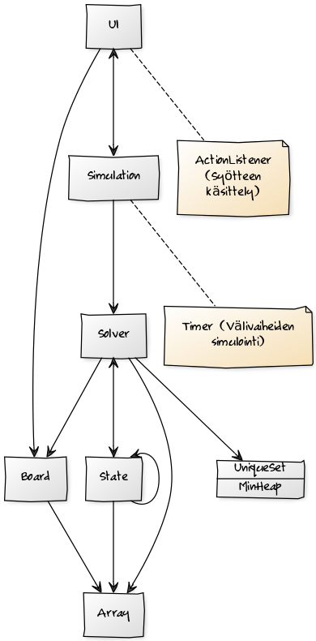
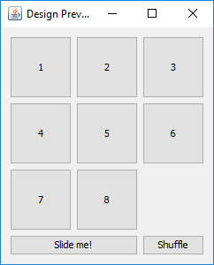

**Aihe:** 8-peli (8-puzzle)

> Toteutetaan interaktiivinen versio 8-pelistä graafisella käyttöliittymällä. Pelin ajatuksena on järjestää numeroidut ruudut luvuista 1..8 suuruusjärjestykseen siirtämällä aina yksi ruutu kerrallaan vapaaruudun tilalle, kun se on naapurina pysty- tai vaakatasolla (3*3-ruudun suuruisella alustalla). Pelaaja voi myös pyytää ruutujen sekoituksen, kuitenkin niin ettei peli koskaan saata ruutuja tilanteeseen, jota ei ole mahdollista ratkaista. Lisäksi voi käyttää tekoälyä nykyisen pelitilanteen ratkaisemiseen. Tekoälyn kannalta on olennaista, että ratkaisuun päästään siirtäen mahdollisimman vähän ruutuja. Samalla peli pitää kirjaa tehdyistä siirroista ja ilmoittaa pelaajalle, kun ruudut ovat taas järjestyksessä.

**Käyttäjät:** Pelaaja

**Pelaajan toiminnot:**

* Numeroidun ruudun siirto vapaaruudun tilalle
  * onnistuu, kun vapaaruutu on naapurina pysty- tai vaakatasolla
* Ruutujen sekoitus uuden pelitilanteen luomiseksi
* Simulaation käynnistys, jossa tekoäly ratkaisee pelitilanteen

**Tarkempi selvitys projektista:**

* Toteutetaan A*-algoritmi sekä BFS-algoritmi pelitilanteen ratkaisemiseen. Algoritmien aikavaativuuden tavoitteena on O(|V| + |E|). Tilavaativuuden kannalta on olennaisinta säilyttää 8-pelin peliruutujen järjestys taulukossa, joka tarvittaessa kopioidaan muistiin, siis O(n). Pääasiallinen lähde projektille: https://www.cs.princeton.edu/courses/archive/fall12/cos226/assignments/8puzzle.html ja erityisesti A*-algoritmille: http://theory.stanford.edu/~amitp/GameProgramming/Heuristics.html.

* Valitsin kyseisen projektin, koska se on minulle mielenkiintoinen ongelma: miten erilaiset algoritmit ratkaisevat saman ongelman ja eroavatko ne nopeudessa tai tehokkuudessa olennaisesti. 8-peli suo yksinkertaisen ympäristön tällaiselle kokeilulle, kun taas toisaalta monimutkaisempi ongelma (esim. 15-peli) rajoittaa käytettäviä algoritmeja huomattavasti. A*-algoritmi kiehtoaa minua myös siltä osin, että se ei ollut osana tira-kurssia, mutta sitä sivuttiin lyhyesti "ylikurssina". Erityisesti tekoäly peleissä on minulle kiinnostava aihe ja tästä saan hyvät eväät kokeilemaan tekoälyn kehittämistä pelissä.

* Peli toteutetaan graafisella käyttöliittymällä ja pelaaja voi hiirellä osoittaa ruutuja, siirtäen niitä aina vapaaruutuun yksi kerrallaan. Muut toiminnallisuudet ovat peliruutujen sekoitus uuden pelitilanteen luomiseksi, joka toteutetaan algoritmisesti, sekä simulaation käynnistys, jossa teköäly ratkaisee pelitilanteen.

**Määrittelyvaiheen luokkakaavio:**

**Konsepti graafiselle käyttöliittymälle:**

