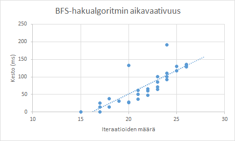

**29.1.2016:**

* Laadittu kattavat yksikkötestit Array-apuluokalle. Luokan toimivuus on hyvin tärkeää koko projektin kannalta, eli laajamittaiset testit ovat myös tärkeitä. Apuluokan kaikkia metodeja ei kuitenkaan voi testata, esim. sekoitusalgoritmin toimintaa on vaikea testata millään tavalla eikä sen oikeellisuutta pysty nyt kunnolla arvioimaan. Yksikkötestejä ei laadittu Board-luokalle lainkaan, koska siinä ei ole mitään erityistä, mitä pitäisi testata ja se lähinnä kutsuu Array-apuluokan metodeja omissa metodeissaan.

**5.2.2016:**

* Yksikkötestejä ei laadittu lainkaan. Koska ohjelmakoodi muokkautui pääosin käyttöliittymän osalta, kului aikaa manuaaliseen käyttöliittymän testaamiseen. Erikseen yksikkötestejä käyttöliittymälle ei siis laadittu. Projektin asetuksia on myös muutettu niin, ettei käyttöliittymän luokkia sisällytetä PIT-raportteihin. Manuaaliseen käyttöliittymän testaamiseen kuului mm. eri toiminnallisuuksien kokeilu siinä määrin, mikä on sallittua ja mikä ei ole sallittua. Peliä on pelattu useita tunteja, kun samalla käyttöliittymää on paranneltu aina sen mukaisesti, kun on parannuskeinoja ja epätoivottua toimintaa havaittu. Käyttökokemukseen on panostettu erityisesti, ettei peli vaikuta kankealta käytön kannalta. Mielipiteitä käyttöliittymästä, komponenttien sijoittelusta sekä toiminnallisuudesta on myös kysytty lähipiiristä ja käyttöliittymää muokattu vastaavasti.

**12.2.2016:**

* Array-apuluokan osalta muutama yksikkötesti on laadittu testaamaan uutta aputoimintoa. Muutoin ohjelmakoodi on muokkautunut lähinnä tekoälyn kannalta, mutta on yhä varhaisessa vaiheessa sen osalta, minkä vuoksi tekoälyyn liittyviä uusia luokkia ei ole erikseen testattu. Yksikkötestejä on luvasssa, mutta ensiksi on minun ymmärrettävä haluamani tekoälyn toiminnallisuus yleisellä tasolla. Halutun toiminnallisuuden aikaansaamiseksi on vielä opittava lisää tekoälyn toteutuksesta ja viimein toteuttaa se. Mahdollinen ratkaisu mm. tekoälyn välivaiheiden ylläpitoon on saanut alkunsa. Mikäli toteutus etenee odotetusti, on seuraava looginen askel testata toiminnallisuutta.

**15.2.2016:**

* Laadittu kattavasti uusia testejä State-luokalle, joka ylläpitää tekoälyn välivaiheita. Erityisesti tuli huomioida testeissä, ettei esim. A*-algoritmi käy läpi vääränlaisia iteraatioita, jolloin kaikki rajatapaukset oli testattava. Erilaisia pelitilanteita testasin empiirisesti ja mittasin tekoälyn suorituskykyä tunnetusti hankalissa tilanteissa. Hiomista on vielä tehtävä ja erityisesti omat tietorakenteet laadittava korvaamaan nykyisen toteutuksen HashSet- ja PriorityQueue-tietorakenteet. Kun nämä ovat kiitettävässä kunnossa, mitä luultavimmin jo seuraavassa päivityksessä, on aika pitää kirjaa algoritmin tuloksista ja suorituskyvystä. Vielä ei ole sen saralta mitään ihmeellistä raportoitavaa, muuta kuin että tekoäly nykyisellään toimii!

**24.2.2016:**

* Uusia yksikkötestejä laadittu tekoälyn toiminnallisuuksien puolelle, mm. UniqueSet-tietorakenteen osalta. MinHeap-luokan yksikkötestit uupuvat vielä, mutta ovat seuraavaksi vastassa heti kun viimeisetkin optimoinnit luokkaan ovat tehty. Suorituskykytestausta laadittu kattavasti, tulosten tutkiminen on vielä kesken, koska paikoin huomasin poikkeuksellisia tuloksia. Niiden osalta täytyy selvittää, onko kyseessä "bugi vai ominaisuus" ja miksi niin tapahtuu. Esim. pelitilanteet, joiden ratkaisuun vaaditaan vähemmän kuin 20 siirtoa, vaativat jostain syystä nyt enemmän aikaa kuin pelitilanteet, joiden ratkaisuun siirtoja vaaditaan enemmän. Samanlainen käytös oli havaittavissa jo silloin, kun käytössä olivat Javan omat HashSet sekä PriorityQueue -tietorakenteet. Toteutettuani niiden korvaajat, UniqueSet ja MinHeap, on suorituskyky muuttunut huomattavasti parempaan suuntaan, mutta vaikuttaa edelleen siltä, että osassa pelitilanteita menee tekoälyllä enemmän aikaa päätyä ratkaisuun kuin olisi ehkä tarpeen. Tämä voi liittyä myös Javan omaan toimintatapaan, eli suorituskykyä on testattava enemmän, jotta luvut saadaan julkaisukelpoisiksi.

**2.3.2016:**

* Edellisen testauksen yhteydessä esiin tullut "bugi vai ominaisuus" on nyt korjattu. Samoin on koodia hiottu hieman entisestään ja suorituskykyä testattu oleellisesti. Eri heuristiikalla toimivat algoritmit muodostavat nyt odotuksen mukaiset käyrät eli BFS-algoritmi kasvaa "lineaarisesti", mutta A*-algoritmi eksponentiaalisesti. Hakualgoritmin aikavaativuus on tosiaan O(|V| + |E|), jossa O(|E|) on väliltä O(1) ja O(|V|^2) syötteestä riippuen. Aluksi keräsin tietoa 30 eri pelitilanteesta kullekin algoritmille, joista kaaviot näyttävät seuraavanlaisilta:

